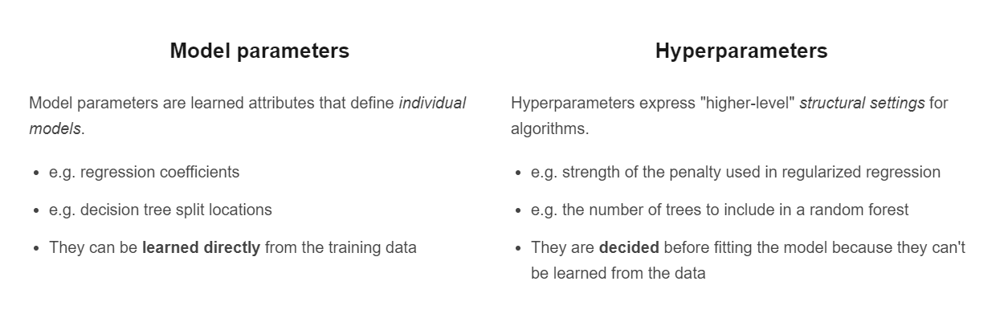

# Read: Data Science Primer

## Bird's Eye View

Generally speaking, we can break down applied machine learning into the following chunks:


## Exploratory Analysis

There’s a big challenge in data science called “Tactical Hell.” This is actually a term from startups, and it’s when you have too many tactics to choose from:

Should you develop your product more? Invest in marketing? Hire an accountant? Etc.

In many ways, training a ML model is like growing a startup. You also have too many tactics to choose from:

Should you clean your data more? Engineer features? Test new algorithms? Etc.

There’s a lot of trial and error, so how do you avoid chasing dead ends? The answer is “Exploratory Analysis.” (Which is just fancy-talk for “getting to know” your data.)

Doing this upfront helps you save time and avoid wild goose chases… As a data scientist, you are a commander with limited resources (i.e. time). Exploratory analysis is like sending scouts to learn where to deploy your forces!


## Data Cleaning

>Better data beats fancier algorithms…


## Feature Engineering

In a nutshell, “feature engineering” is creating new model input features from your existing ones.

That doesn’t sounds like much… Yet Andrew Ng, former head of Baidu AI and Google Brain, said:

>“Coming up with features is difficult, time-consuming, requires expert knowledge.
‘Applied machine learning’ is basically feature engineering.”


## Algorithm Selection

In applied machine learning, individual algorithms should be swapped in and out depending on which performs best for the problem and the dataset.

## Model Training

It might seem like it took a while to get here, but data scientists actually do spend most their time on the earlier steps:

1. Exploring the data.
2. Cleaning the data.
3. Engineering new features.


Again, that’s because better data beats fancier algorithms.

### What are Hyperparameters?

When we talk of tuning models, we specifically mean tuning **hyperparameters**.



### Fit and Tune Models

Basically, all we need to do is perform the entire cross-validation loop detailed above on each set of hyperparameter values we'd like to try.
​
The high-level pseudo-code looks like this:

```
For each algorithm (i.e. regularized regression, random forest, etc.):
  For each set of hyperparameter values to try:
    Perform cross-validation using the training set.
    Calculate cross-validated score.

```

At the end of this process, you will have a cross-validated score for each set of hyperparameter values... for each algorithm.

### Select Winning Model

We use these questions to help you pick the winning model:

1. Which model had the best performance on the test set? (performance)
2. Does it perform well across various performance metrics? (robustness)
3. Did it also have (one of) the best cross-validated scores from the training set? (consistency)
4. Does it solve the original business problem? (win condition)


## *The End*