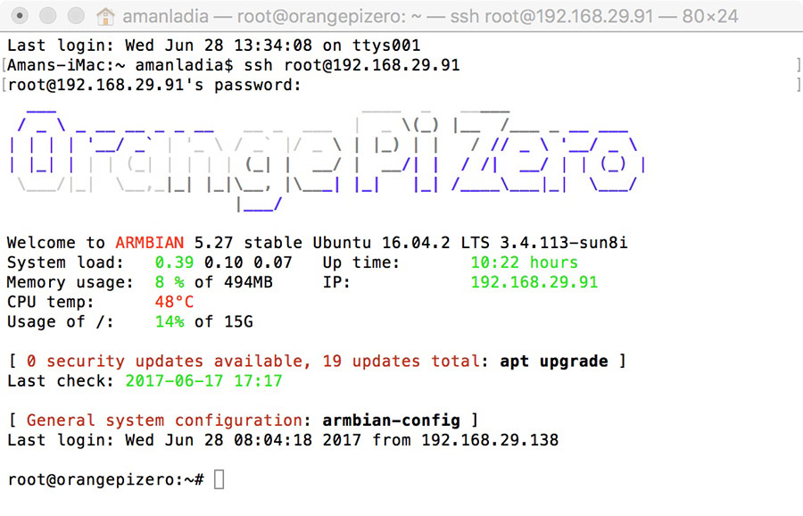

# Django Settings Best Practices

## Managing Django Settings: Issues
* Different environments. Usually, you have several environments: local, dev, ci, qa, staging, production, etc.
* Sensitive data. You have SECRET_KEY in each Django project. On top of this there can be DB passwords and tokens for third-party APIs like Amazon or Twitter. This data cannot be stored in VCS.
* Sharing settings between team members. You need a general approach to eliminate human error when working with the settings. 
* Django settings are a Python code. This is a curse and a blessing at the same time. It gives you a lot of flexibility, but can also be a problem – instead of key-value pairs, settings.py can have a very tricky logic.


## Setting Configuration: Different Approaches

There is no built-in universal way to configure Django settings without hardcoding them. But books, open-source and work projects provide a lot of recommendations and approaches on how to do it best. Let’s take a brief look at the most popular ones to examine their weaknesses and strengths.

* The basic idea of this method is to extend all environment-specific settings in the settings_local.py file, which is ignored by VCS.

## Separate settings file for each environment

```
settings/
   ├── __init__.py
   ├── base.py
   ├── ci.py
   ├── local.py
   ├── staging.py
   ├── production.py
   └── qa.py

```

## Environment variables
To solve the issue with sensitive data, you can use environment variables.

```
import os


SECRET_KEY = os.environ['SECRET_KEY']
DATABASES = {
    'default': {
        'ENGINE': 'django.db.backends.postgresql',
        'NAME': os.environ['DATABASE_NAME'],
        'HOST': os.environ['DATABASE_HOST'],
        'PORT': int(os.environ['DATABASE_PORT']),
    }
}
```

12 Factors
12 Factors is a collection of recommendations on how to build distributed web-apps that will be easy to deploy and scale in the Cloud. It was created by Heroku, a well-known Cloud hosting provider.

As the name suggests, the collection consists of twelve parts:

1. Codebase
1. Dependencies
1. Config
1. Backing services
1. Build, release, run
1. Processes
1. Port binding
1. Concurrency
1. Disposability
1. Dev/prod parity
1. Logs
1. Admin processes
Each point describes a recommended way to implement a specific aspect of the project. Some of these points are covered by instruments like Django, Python, pip. Some are covered by design patterns or the infrastructure setup. In the context of this article, we are interested in one part: the **Configuration**.


# SSH

## What is SSH
SSH, or Secure Shell, is a remote administration protocol that allows users to control and modify their remote servers over the Internet. The service was created as a secure replacement for the unencrypted Telnet and uses cryptographic techniques to ensure that all communication to and from the remote server happens in an encrypted manner. It provides a mechanism for authenticating a remote user, transferring inputs from the client to the host, and relaying the output back to the client.

* The Figure Below shows a typical SSH Window.



## Understanding Different Encryption Techniques

The significant advantage offered by SSH over its predecessors is the use of encryption to ensure secure transfer of information between the host and the client. Host refers to the remote server you are trying to access, while the client is the computer you are using to access the host. There are three different encryption technologies used by SSH:

1. Symmetrical encryption
1. Asymmetrical encryption
1. Hashing.

### Symmetric Encryption

Symmetric encryption is a form of encryption where a secret key is used for both encryption and decryption of a message by both the client and the host. Effectively, any one possessing the key can decrypt the message being transferred.

### Asymmetric Encryption

Unlike symmetrical encryption, asymmetrical encryption uses two separate keys for encryption and decryption. These two keys are known as the public key and the private key. Together, both these keys form a public-private key pair.

### Hashing

One-way hashing is another form of cryptography used in Secure Shell Connections. One-way-hash functions differ from the above two forms of encryption in the sense that they are never meant to be decrypted. They generate a unique value of a fixed length for each input that shows no clear trend which can exploited. This makes them practically impossible to reverse.


[For more information](https://djangostars.com/blog/configuring-django-settings-best-practices/)
[For more information(SSH)](https://www.hostinger.com/tutorials/ssh-tutorial-how-does-ssh-work)
